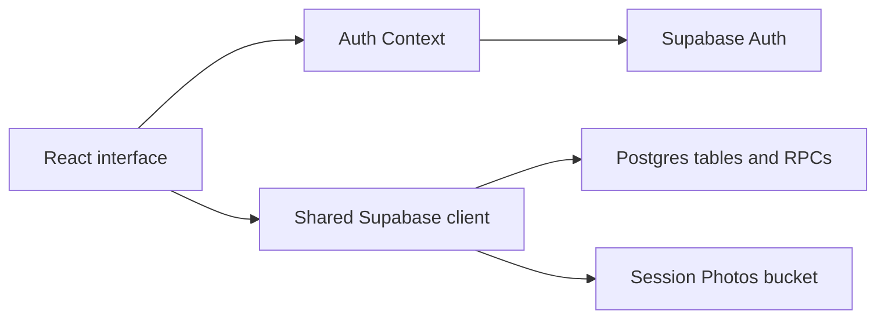

# Architecture and tradeoffs

## Application structure

```text
src/
├── components/
│   ├── layout/          Navigation and footer
│   └── modals/          Client/project creation and scheduling
├── context/             Shared Supabase authentication state
├── features/
│   ├── auth/            Login page
│   ├── insights/        Studio metrics and charts
│   └── projects/        Dashboard, project details, sessions, photo editing
├── lib/                 Shared Supabase client
├── App.jsx              Dashboard shell and login redirect
├── router.jsx           Dashboard and login routes
├── App.css              Application styling
└── main.jsx             React entry point
```

The browser talks directly to Supabase using a publishable key. Authentication state is shared through React Context. Components query related records using the Supabase client, while the upcoming-session summaries call the `studio_upcoming_session` database RPC. `StudioMember` gates access to all records and photos.



The core data relationships are one client to many projects, and one project to many sessions. Projects and sessions each reference a status. Session records store an array of storage object paths (legacy same-project URLs are also supported); the image files themselves live in Storage.

The Insights page reads project and session rows with the same member-limited Supabase permissions as the dashboard. It paginates reads beyond Supabase's default result limit and computes chart summaries in the browser. Payment charts use session `amount_paid` and appointment dates; project prices and deposits are excluded to avoid counting the same money twice. True profit needs expense and payment-date records that this schema does not have.

The optional Google Calendar Edge Function keeps refresh tokens and event mappings in tables inaccessible to browser roles. Its public OAuth callback consumes a short-lived state token; other actions verify a signed-in studio member. The browser requests a reconciliation after session/project edits and every two minutes while open. This is one-way app-to-Google sync and needs Google Cloud credentials before deployment.

## Implementation choices

- **Managed backend:** Supabase provides authentication, database access, and file storage without a separate application server. Authorization consequently depends on database, RPC, and storage policies; a UI redirect is not an access boundary.
- **Local form state:** forms build explicit insert/update payloads, including numeric IDs and a boolean deposit flag. This makes the relationship between UI inputs and stored fields visible.
- **Shared detail view:** the project cards and upcoming-session summary reuse the project details view.
- **Refresh after writes:** callbacks reload relevant data; creating a project changes a key to remount the dashboard grid. This is simple, but refresh behavior is not consistent across every nested view.
- **Photo uploads:** the active session editor gives each file a unique path before storing its object path on the session. `PrivatePhoto` obtains a signed viewing URL and refreshes it before expiry. Storage uploads and database writes are separate operations, so partial failures can leave unused files.

## Validation and remaining work

The existing-backend migration restricts records and storage to approved studio members, seeds missing statuses, adds a London-time upcoming-session query, and provides atomic project/session deletion. See [setup](SETUP.md) for application and database regression checks.

Future improvements include splitting the remaining large project detail component, a standalone client directory, self-service account recovery, appointment conflict detection, and scheduled orphan-file cleanup. The current app is a single-studio workspace, not a multi-tenant booking service.
